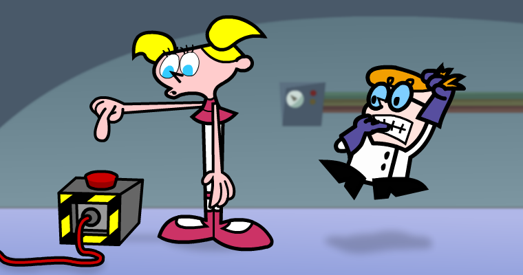
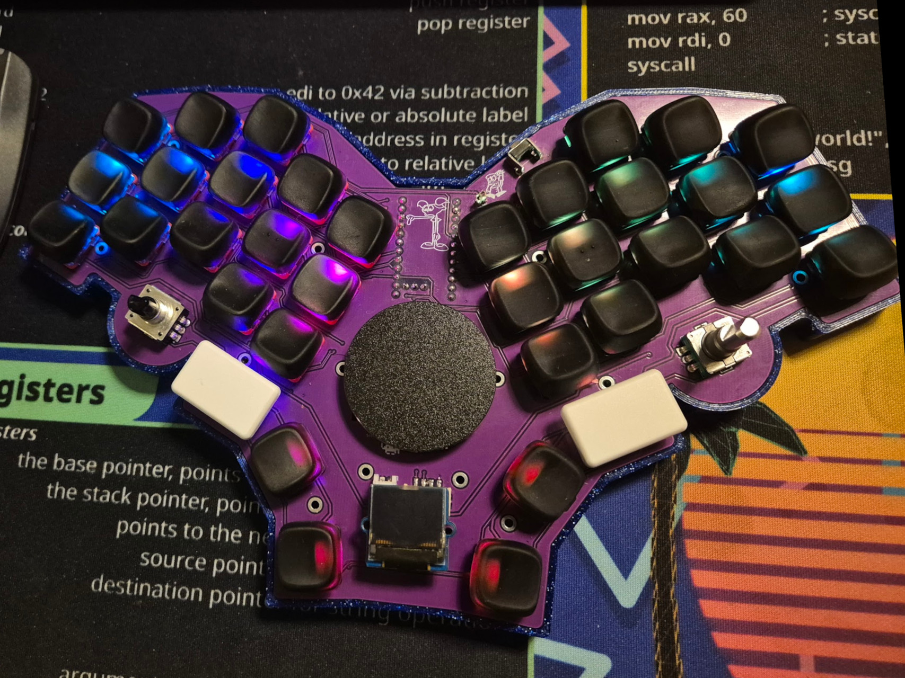

# DeeDee

A 36+2 key split monoblock ortholinear keyboard

## Current progress:

- [x] Key matrix
- [x] Layout defined
- [x] Addressable LEDs
- [x] Rotary encoders
- [ ] SSD1306 OLED screen
- [ ] Cirque touchpad
- [ ] Case design

A place where I try to document every step of the process is journalled in my [Project blog posts](https://github.com/simisimis/project-blog/tree/main/projects/DIY-keyboard) repo.

